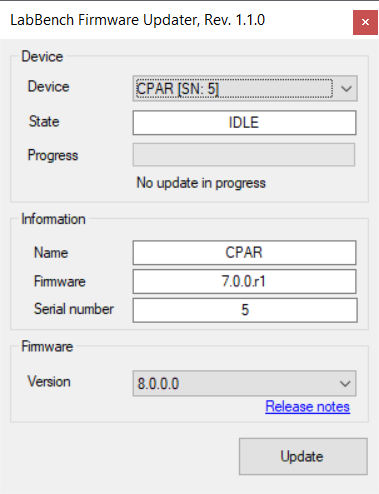
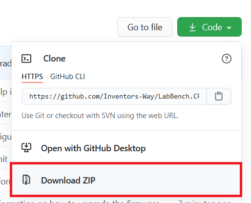

# LabBench.CPAR

Matlab toolbox for the Cuff Pressure Algometry Research (CPAR) device from Nocitech ApS.

## Prerequisites

LabBench is used to manage the connection to CPAR devices. Consequently,
the Matlab toolbox does not handle connection, communication and
disconnection with CPAR devices, but this is instead handled by the
LabBench Instrument Database.

This has the advantage that any error or exception in Matlab will not
cause the CPAR device to be locked or similar, which could for example
occur if Matlab directly opened a connection to the cpar device, an
error occurred, and the connection was never closed again. If the cpar
device could get locked it would only be possible to recover from this
 error by restarting Matlab.

### LabBench

The CPAR toolbox requires LabBench to be installed and properly configured on the machine,
as the toolbox use the CPAR device drivers of LabBench to communicate and control the CPAR
device.

The CPAR device is delivered with a lab computer which comes preconfigured with
the software required to use the CPAR device. If your CPAR device has a serial number
of 15 or higher this lab computer comes with LabBench, and the computer will be ready for
a Matlab install and installation of this toolbox.

However, if your device has a serial number of 14 or lower, the lab computer will have been
delivered with the CPAR Runner software, which is not supported by this toolbox. In that
case you will have to install and configure LabBench. You may also wish to install and
configure LabBench on an additional computer, in the case it is easier or only possible
to use Matlab on a second computer. The for LabBench license is tied to the device, and
consequently, you can install LabBench on as many computers you require without limitation.

If you require to install LabBench on additional computers, or if it has not been installed
on the lab computer that was delivered with the CPAR device, then please contact
```info@inventors.dk```.

### CPAR Firmware

The firmware on CPAR device needs to be Version 8.0.0 or higher. Which version is currently running on your CPAR
device can be checked with the LabBench Firmware Updater:



In the example above, CPAR is running Version 7.0.0, which is not compatible with the current toolbox and needs to
updated. To update the firmware, verify that version 8.0.0 or newer is selected under Firmware and press the Update
button.

If it does not display your CPAR device, please check that the device is connected to the computer and that no other
program (such as CPAR Runner or LabBench) is currently connected to the device. Another problem can arise if the
computer is not connected to the internet. The program needs internet connectivity to contact the firmware server, in
order to download new firmware to your CPAR device.

## Installation

For installation copy the cpar directory in the current repository to a suitable location on your computer, and add this directory
to the path of Matlab.

There are at least two ways of obtaining this toolbox:

### Download the toolbox as a zip file from Github

In top right hand corner of the page you are currently reading there is a Code button. Click on this button and choose Download ZIP
(this is marked with a red box in the figure below).



This will download all the code in this repository to your computer as a zip file.

### Fork the repository into your own Github account

If you understand the headline of this section, we would probably insult you if we started explaining you how to get a copy of this toolbox.
We will greatly appreciate if you choose to fork this repository, and you choose to contribute. Any contributions will be valued and appreciated.

## Usage

Below is an example that demonstrate how to use the toolbox to perform pressure stimulations with the CPAR device, 
and how to collect data from the CPAR device:

```matlab
% Create a device and open communication with the device.
%
% If the script is called multiple times, then this will produce a warning
% that the instrument database is allready initialized. This has no bad
% consequences.
cparInitialize;

try
    % Next step is to retrieve the cpar device. We do this by assuming that
    % there is only one cpar device installed on the system, by retrieving all
    % the IDs of cpar devices from LabBench, and the getting the first device
    % on the list.
    %
    % If there is more than one cpar device on the machine this code needs to
    % be rewritten and the device ID must be known and inserted into the
    % script.
    IDs = cparList;
    dev = cparGetDevice(IDs(1));

    % The first time the script is run it will take some time for the LabBench
    % Instrument Database to open a connection to the cpar device after the
    % cparGetDevice is called. We therefore wait until the error is cleared on
    % the device, which signals that a connection has been established and it
    % is ready to use.
    fprintf('Waiting to connect .');
    tic
    while cparError(dev)
        fprintf('.');
        pause(0.2);

        if toc > 10
            me = MException('CPAR:TimeOut', 'No connection');
            throw(me);
        end
    end
    fprintf(' connected\n');

    % Create the pressure waveforms one for each pressure outlet 1 and 2.
    %
    % An empty waveform is first created with the cparCreateWaveform
    % function, which as argument takes which pressure outlet to use (1 or
    % 2) and how many times the waveform shall be repeated.
    %
    % Afterwards the waveform is populated with instructions that are used
    % by the waveform interpreter in the cpar device to generate the
    % pressure waveform. There are three instructions; step, dec, and inc.
    waveform01 = cparCreateWaveform(1, 1);
    
    % This creates a immediate change (step) in the pressure. In this case
    % the pressure is set to 20kPa. The second argument is the number of
    % seconds that the pressure is held for before the next instruction is
    % executed. In this case the time is zero, which means that the next
    % instruction is executed immediately in the execution cycle as this
    % step instruction.
    cparWaveform_Step(waveform01, 20, 0);
    
    % This creates a linearly increasing pressure with a slope of 30kPa/s
    % for onle second. It is possible to set its duration to 0s, but
    % then the instruction would have no effect.
    cparWaveform_Inc(waveform01, 30, 1);
    
    % This creates a linearly decreasing pressure with a slope of 20kPa/s
    % for one second.
    cparWaveform_Dec(waveform01, 20, 1);
   
    % We create an empty waveform for the second pressure outlet of the
    % CPAR device. This is to ensure that there is no waveform configured
    % for that pressure outlet, and hence, no stimulation is given on the
    % cuff connected to pressure outlet 2.
    waveform02 = cparCreateWaveform(2, 1);   
    
    % This sets the pressure waveforms for pressure outlet 1 and 2. Both
    % waveforms must be set at the same time to ensure that there is not an
    % old waveform stored in one outlet, thereby, leading to an unintended
    % pressure stimulation.
    cparSetWaveform(dev, waveform01, waveform02);

    fprintf('Running pressure stimulation ');

    % Start the stimulation    
    % This will start the stimulation even if the VAS score is not set to
    % zero. The stimulation is stopped when either the pressure waveform
    % programs is completed or the subject presses the button.
    %
    % This also implicitly starts the collection of data, which can be
    % retrived with the cparGetData function.
    cparStart(dev, 'bp', true);    
    
    % Initialize a data sampling structure 
    data = cparInitializeSampling;
    
    % Wait until stimulation has completed
    while (cparIsRunning(dev))
        fprintf('.');
        pause(0.2);        
    end
    fprintf(' completed\n'); 

    % Retrive data from the device. 
    data = cparGetData(dev, data);
    
    % Finalize the sampling structure, which converts the data in contains
    % in to Matlab matrices that are easier to process in Matlab.
    %
    % This also calls the cparStopSampling function, which must be called
    % after either the cparStart or cparStartSampling function is called.
    % If it is not called at some point after one of these two functions
    % has been called, the cpar device will continue to collect data, and
    % will gradually fill up the memory of the computer, albeit, on a
    % modern computer with GB of memory this may takes many hours or days
    % to happen.
    %
    % If data is not collected from the cpar device (i.e.
    % cparFinalizeSampling is not called). Then cparStopSampling must be
    % called instead, however, in that case it can be called immediately
    % after cparStart is called, even if the pressure stimulation has not
    % completed yet.
    data = cparFinalizeSampling(dev, data);
    
    % Plot data retreived from the cpar device.
    cparPlot(data);

catch me
    me
end
```
